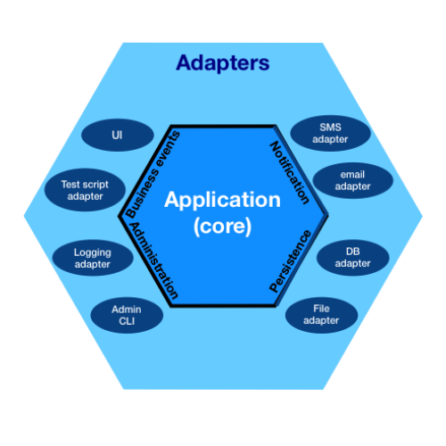

layout: page
title: "hexagonal-architecture"
permalink: /hexagonal-architecture


# Hexagonal Architecture 💠
---

The hexagonal architecture is by far the most used architecture in terms of DDD.
It is a layered architecture created by Allistair Cockburn in 2005 and it belongs to the _clean architecture group_.
In order to create a more maintenable and replaceable code, exists a dependency rule, which only allows one layer _to know_
about itself and the immediately inner layer.
👁️‍ 🟥 A red light in terms of dependency rule are class imports. E.g: If we are in the infrastructure layer we only should be able to read both, infrastructure or application imports, but never a domain layer import. 




[wikipedia domain driven design](https://en.wikipedia.org/wiki/Domain-driven_design)


- As we can see, the external layer (infrastructure) hosts the relationships within the app's external world.
The most common content in this layer are the domain layer implementations and the references to the persistence system, email agent, cloud service...

- In the application layer we usually found use cases or actions that our app is able to make. Here are also located one of any DDD app main elements: the domain events, which basically spread the notification of siome ocurred event through the different parts of our achitecture.

- At last, domain layer is the richiest in terms of information and concepts. It holds the business rules which influences the entire app. The most common content here are interfaces and abstract classes, implemented later in the infrastructure layer.

The transformation of the outter data into domain objects is made by the ports and adapter structure. A port takes incomming data and the adapter just tries to convert them.
I have seen many ways to do this, so I developed my own example, in which the conversion takes place into the application layer.
It can be performed by an specific service or even the use case itself.


```@CommandHandler
	public void createIncidence (CreateIncidenceCommand command) {
		
		List<String> allWorkers   = wokerRepo.getAllWorkers();
		if(!allWorkers.contains(command.getCreator()))
			throw new IllegalArgumentException("The id "+command.getCreator()+" doesn't match with any of our registered workers");
		
    // here is where the conversion begins. If any data is incorrect, an exception is raised
    
		final IncidenceId id                        = new IncidenceId(command.getId());
		final WorkerId creator                      = new WorkerId(command.getCreator());
		final IncidenceCreationTimeStamp createdOn  = new IncidenceCreationTimeStamp(Constants.TIMESTAMPS_FORMAT.format(new Date()));;
		final IncidenceShortDescription description = new IncidenceShortDescription(command.getDescription());
		
		final Incidence incidence = Incidence.create(id,creator,createdOn,description);
		incideceRepo.save(incidence);
		eventBus.publish(incidence.pullDomainEvents());
		
	}

```


## ❗ This is just a hex. architecture glimpse, made in an introductive way. There are tons of info about it on YT and really good posts.

Referring to the directory structure
------
- [hexagonal arch. post](https://netflixtechblog.com/ready-for-changes-with-hexagonal-architecture-b315ec967749)
- [](https://www.youtube.com/watch?v=y3MWfPDmVqo)
- [](https://www.youtube.com/watch?v=zyOQ3tRL7mk "spanish")


---
## [index](https://jmiquis.github.io/TFG-DDD-Theoretical/) 
---
